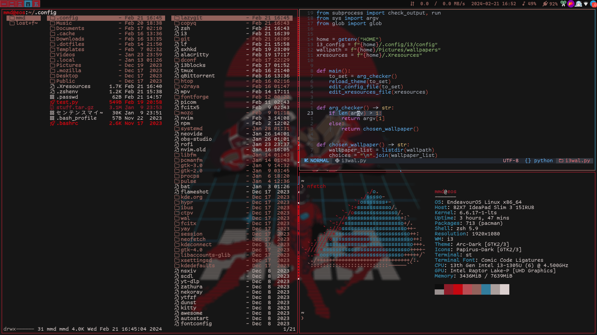
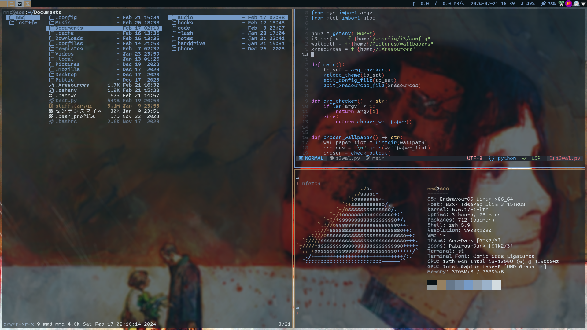
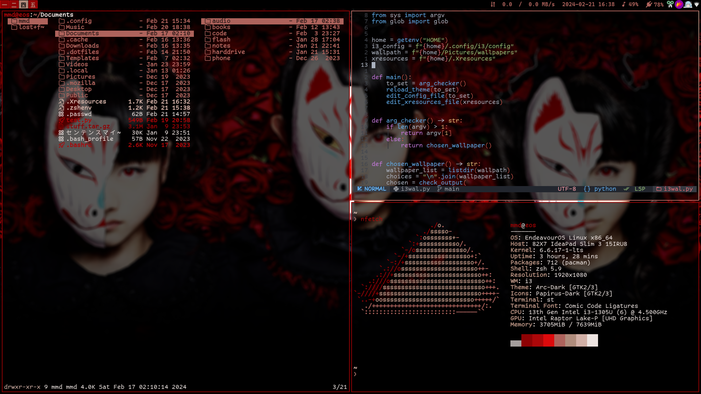
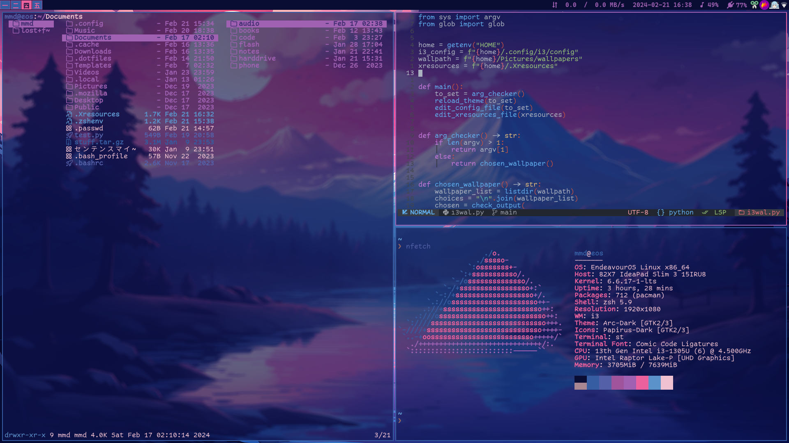

# cook rice on the fly🍙




# dependencies
- xwallpaper(must be set somewhere in the i3 config file)
    - for example:
    ```xwallpaper --zoom "/home/mmd/Pictures/wallpapers/lain.png"```
- pywal
- .Xresources file at home folder(must be a symlink pointing to ~/.cache/wal/colors.Xresources)
- i3 config at .config/i3/config(can be changed in the script)
- wallpapers folder at ~/Pictures/wallpapers(can be changed in the script)
- rofi(can be changed to dmenu in the script)

# note:
unless you're using st with the xresources patch, the script probably wouldn't change yout terminal's colorscheme
in which case simply set your colorscheme to the appropriate one found under ~/.cache/wal
